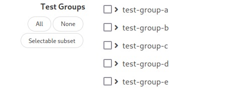
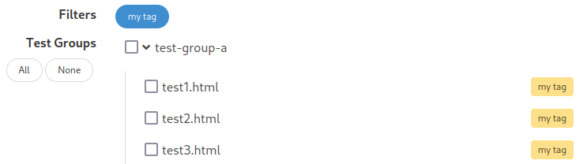

# Configuration - [WAVE Test Runner](./README.md)

Using a configuration file, the WAVE Test Runner can be configured to be more
functional in different use cases. This document lists all configuration
parameters and what they are used for.

## Contents

1. [Location and structure](#1-location-and-structure)
2. [Parameters](#2-parameters)
   1. [Results directory](#21-results-directory)
   2. [Test Timeouts](#22-test-timeouts)
   3. [Enable import of results](#23-enable-import-of-results)
   4. [Web namespace](#24-web-namespace)
   5. [Persisting interval](#25-persisting-interval)
   6. [API titles](#26-api-titles)
   7. [Enable listing all sessions](#27-enable-listing-all-sessions)
   8. [Event caching duration](#28-event-caching-duration)
   9. [Pre test control page delay](#29-pre-test-control-page-delay)
   10. [Host override](#210-host-override)
   11. [Enable test type selection](#211-enable-test-type-selection)
   12. [Tests base URL](#212-tests-base-url)
3. [Test Subsets](#3-test-subsets)
   1. [Define a subset](#31-define-a-subset)
   2. [Make subset selectable](#32-make-subset-selectable)
   3. [Default subsets](#33-default-subsets)
   4. [Tags and filters](#34-tags-and-filters)
   5. [Default filters](#35-default-filters)
   6. [Messages](#36-messages)

## 1. Location and structure

Configuration parameters are defined in a JSON file called `config.json` in
the project root of the WPT runner. This configuration file is also used by
the WPT runner, so any WAVE Test Runner related configuration parameters are
wrapped inside a `wave` object.

```
<PRJ_ROOT>/config.json
```

```json
{
  "wave": {
    "results": "./results"
  }
}
```

All the default values are stored in a configuration file inside the wave
directory:

```
<PRJ_ROOT>/tools/wave/config.default.json
```

```json
{
  "wave": {
    "results": "./results",
    "timeouts": {
      "automatic": 60000,
      "manual": 300000
    },
    "enable_import_results": false,
    "web_root": "/_wave",
    "persisting_interval": 20,
    "api_titles": [],
    "enable_read_sessions": false,
    "event_cache_duration": 60000
  }
}
```

[▲ top](#configuration---wave-test-runner)

## 2. Parameters

### 2.1 Results directory

The results parameter sets where results and session information are stored.

**Parameters**:

```json
{
  "results": "<String>"
}
```

- **results**: Path to the results directory. Can be absolute, or relative to
  the project root.

**Default**:

```json
{
  "results": "./results"
}
```

[▲ top](#configuration---wave-test-runner)

### 2.2 Test Timeouts

The test timeouts set the default test timeout for different test types.

**Parameters**:

```json
{
  "timeouts": {
    "automatic": "<Number>",
    "manual": "<Number>"
  }
}
```

- **timeouts**: Holds the key value pairs for different types of tests
  - **automatic**: Default time to wait for automatic tests in milliseconds.
  - **manual**: Default time to wait for manual tests in milliseconds.

**Default**:

```json
{
  "timeouts": {
    "automatic": 600000,
    "manual": 300000
  }
}
```

[▲ top](#configuration---wave-test-runner)

### 2.3 Enable import of results

This parameter enables the capability to import session results from other
WAVE Test Runner instances into the current one.

**Parameters**:

```json
{
  "enable_import_results": "<Boolean>"
}
```

- **enable_import_results**: Sets whether or not to enable the [REST API endpoint to import results](./rest-api/results-api/import.md)

**Default**:

```json
{
  "enable_import_results": "false"
}
```

[▲ top](#configuration---wave-test-runner)

### 2.4 Web namespace

All static resources and REST API endpoints are accessible under a
configurable namespace. This namespace can be set using the `web_root`
parameter.

**Parameters**:

```json
{
  "web_root": "<String>"
}
```

- **web_root**: The namespace to use

**Default**:

```json
{
  "web_root": "/_wave"
}
```

[▲ top](#configuration---wave-test-runner)

### 2.5 Persisting interval

The persisting interval specifies how many tests have to be completed until
all session information is updated in the results directory.

For example, if set to 5, then every 5 completed tests the `info.json` in the
results directory is updated with the current state of the session. When
restarting the server, this state is used to reconstruct all sessions testing
state.

**Parameters**:

```json
{
  "persisting_interval": "<Number>"
}
```

- **persisting_interval**: The number of tests to execute until the persisted
  session information gets updated

**Default**:

```json
{
  "persisting_interval": 20
}
```

[▲ top](#configuration---wave-test-runner)

### 2.6 API titles

The API titles are used to display a more human readible representation of an
API that tests are available for. Using the parameter it is possible to assign
a name to an API subdirectory.

**Parameters**:

```json
{
  "api_titles": [
    {
      "title": "<String>",
      "path": "<String>"
    },
    ...
  ]
}
```

- **api_titles**: An array of titles assigned to paths
  - **title**: The displayed title of the API in the UI
  - **path**: The path relative to the project root of the tested API

**Default**:

```json
{
  "api_titles": []
}
```

**Example**:

```json
{
  "api_titles": [
    {
      "title": "WebGL",
      "path": "/webgl"
    },
    {
      "title": "WebRTC Extensions",
      "path": "/webrtc-extensions"
    }
  ]
}
```

[▲ top](#configuration---wave-test-runner)

### 2.7 Enable listing all sessions

This parameter enables the [REST API endpoint to list all available sessions](./rest-api/sessions-api/read_sessions.md).

**Parameters**:

```json
{
  "enable_read_sessions": "<Boolean>"
}
```

- **enable_import_results**: Sets whether or not to enable the REST API endpoint read all sessions

**Default**:

```json
{
  "enable_read_sessions": "false"
}
```

[▲ top](#configuration---wave-test-runner)

### 2.8 Event caching duration

This parameters specifies how long events are hold in the cache. Depending on
how fast clients are able to evaluate events, this value may be changed
accordingly.

**Parameters**:

```json
{
  "event_cache_duration": "<Number>"
}
```

- **event_cache_duration**: The duration events are hold in the cache in milliseconds

**Default**:

```json
{
  "event_cache_duration": 60000
}
```

[▲ top](#configuration---wave-test-runner)

### 2.9 Pre test control page delay

This parameter specifies how long the pre-test control pages is active before
redirecting to the actual test.

**Parameters**:

```json
{
  "pre_test_delay": "<Number>"
}
```

- **event_cache_duration**: The duration the pre-test control pages is visible in seconds.

**Default**:

```json
{
  "pre_test_delay": 5
}
```

[▲ top](#configuration---wave-test-runner)

### 2.10 Host override

The `host_override` parameter overrides the hostname of the wpt runner. This
can be used to configure the access to the test runner using a static IP
address. As it is just an override, a proper host file setup as described
[here](https://web-platform-tests.org/running-tests/from-local-system.html#hosts-file-setup)
is still required.

**Parameters**:

```json
{
  "host_override": "<String>"
}
```

- **host_override**: The hostname used to override the existing configuration

**Default**:

None

[▲ top](#configuration---wave-test-runner)

### 2.11 Enable test type selection

Sets display of test type configuration UI elements.

**Parameters**:

```json
{
  "enable_test_type_selection": "<Boolean>"
}
```

- **enable_test_type_selection**: Whether or not test type UI controls are displayed

**Default**:

False

[▲ top](#configuration---wave-test-runner)

### 2.12 Tests base URL

Sets the base URL for links to test implementation URLs in generated reports

**Parameters**:

```json
{
  "tests_base_url": "<String>"
}
```

- **tests_base_url**: String to prepend to relative test urls

**Default**:

Empty String

[▲ top](#configuration---wave-test-runner)

## 3. Test Subsets

The `test-subsets.json`, in the root of the test runner directory, allows to define subsets of tests. These subsets are used in the session configuration page to quickly select these subsets or add tags to the tests to filter them.

[▲ top](#configuration---wave-test-runner)

### 3.1 Define a subset

To define a subset use the json structure as follows:

```json
{
  "subsets": [
    {
      "tests": ["/path/to/test.html"]
    }
  ]
}
```

It is also possible to use wildcards in the path:

```json
{
  "subsets": [
    {
      "tests": ["/path/to/directory/*", "*-manual.html"]
    }
  ]
}
```

[▲ top](#configuration---wave-test-runner)

### 3.2 Make subset selectable

To make a defined subset available for selection in the configuration page, you have to assign it a title:

```json
{
  "subsets": [
    {
      "title": "Selectable subset",
      "tests": ["/path/to/test.html"]
    }
  ]
}
```



[▲ top](#configuration---wave-test-runner)

### 3.3 Default subsets

Defining a subset as default subset will select it automatically when opening the configuration page.

```json
{
  "subsets": [
    {
      "default_subset": true,
      "tests": ["/path/to/test.html"]
    }
  ]
}
```

[▲ top](#configuration---wave-test-runner)

### 3.4 Tags and filters

A subset can be used to apply tags to tests, which can be filtered:

```json
{
  "subsets": [
    {
      "tag": {
        "title": "my tag",
        "color": "warning"
      },
      "tests": ["/test-group-a/*"]
    }
  ]
}
```



[▲ top](#configuration---wave-test-runner)

### 3.5 Default filters

Defining a default filter automatically activates it when opening the configuration page:

```json
{
  "subsets": [
    {
      "tag": {
        "title": "my tag",
        "color": "warning",
        "default_filter": true
      },
      "tests": ["/test-group-a/*"]
    }
  ]
}
```

For possible colors click [here](https://bulma.io/documentation/elements/tag/#colors)

[▲ top](#configuration---wave-test-runner)

### 3.6 Messages

Defining a messages shows a corresponding message box whenever a test from this subset is selected:

```json
{
  "subsets": [
    {
      "tag": {
        "title": "my tag",
        "color": "warning"
      },
      "message": {
        "text": "Text to display in the message box. [Link](https://link.somwhere/)",
        "color": "info"
      },
      "tests": ["/test-group-a/*"]
    }
  ]
}
```

For possible colors click [here](https://bulma.io/documentation/components/message/#colors)

[▲ top](#configuration---wave-test-runner)
